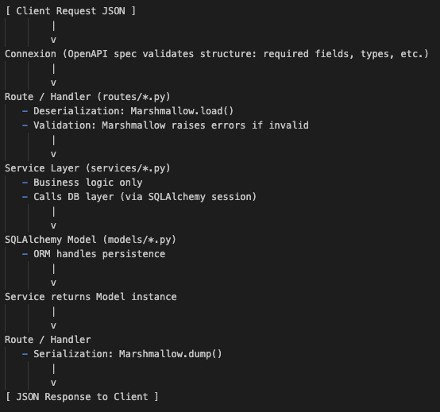

# User Service
#### built with python - flask - connexion - SQLAlchemy

A study project for Flask REST API



### Setup
1. Python => 3.8.19
2. [`uv`](https://docs.astral.sh/uv/getting-started/installation/) installed 
3. Setup Python [`virtual environment`](https://docs.python.org/3/library/venv.html)
4. uv sync

### Running Locally

```bash
uvicorn app:create_app --reload
```

### Swagger UI
```
http://{host:port}/api/ui/
```